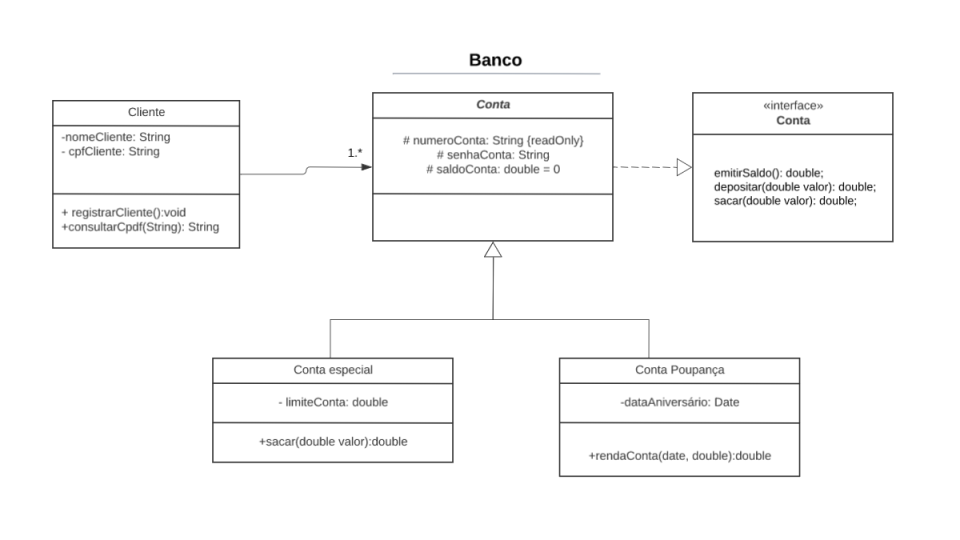

# Atividade - 01 Conceitos de OO
Este repositório é destinado à criação de uma simples aplicação 
cujo objetivo é exemplicar conceitos-chaves do paradigma da orientação
a objetos. Além disso é apresentado também exemplo de teste TDD com JUnit.

<h3>Diagrama de classe</h3>

